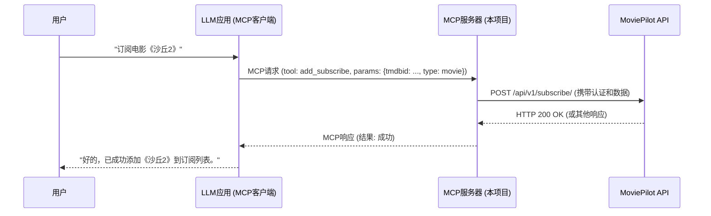

最近我开发了一个MCP的项目——[MoviePilot-MCP](https://github.com/Pollo3470/MoviePilot-MCP)，这是一个为 MoviePilot 配套的 MCP (Model Context Protocal / 模型上下文协议) 服务器。可以通过让大语言模型调用MoviePilot的各项功能，实现影片搜索与推荐，添加/管理订阅等功能。想和大家分享一下从零开始构建这个MCP服务器的一些思考和过程。

## 背景

[MoviePilot](https://github.com/jxxghp/MoviePilot/) 是一个强大的自动化媒体管理工具，它可以帮助我们自动追剧、下载电影、整理媒体库等。但对于不了解这个软件的机制和操作的用户，直接进行页面操作可能需要一些上手成本。因此我想到：为什么不把这些操作交由AI来进行？用户只需用文字描述自己的需求，AI即可帮助用户进行影片搜索推荐、订阅、下载、媒体库管理等。

正好，AI巨头[Anthropic](https://www.anthropic.com/)在不久前推出了[MCP协议](https://modelcontextprotocol.io/introduction)。

> MCP 是一个开放协议，标准化了应用程序如何向 LLMs 提供上下文。可以将 MCP 视为 AI 应用程序的 USB-C 端口。就像 USB-C 提供了一种标准化的方式将你的设备连接到各种外围设备和配件一样，MCP 提供了一种标准化的方式将 AI 模型连接到不同的数据源和工具。

因此，我可以通过开发一个MCP Server来对接MoviePilot实现我的上述需求。在AI客户端接入我的MCP Server即可让AI与我的MoviePilot交互。

我的这个MCP Server对应如下时序图：



## 技术选型

考虑到快速开发和 Python 生态的成熟度，我选择了 **Python** 作为主要的开发语言。这与 MoviePilot 本身的技术栈也保持了一致性。

MCP框架我刚开始使用的[官方Python SDK](https://github.com/modelcontextprotocol/python-sdk)。在开发过程中，由于不确定框架是否支持使用Pydantic作为参数定义/校验/客户端展示，因此改用了明确支持Pydantic的[FastMcp](https://github.com/jlowin/fastmcp)。

由于框架支持异步，因此Http客户端我选用了同样支持异步的httpx。

## 核心架构与设计思路

### MoviePilot接口调用与认证

MoviePilot虽然有API Token认证机制，但仅有少部分接口支持，无法实现大部分功能。因此，在认证方面选用与用户界面一致的认证逻辑：通过账密获取jwt token->在后续请求头中携带token进行认证。
账密通过从环境变量中获取，因此在MCP客户端使用本Server时需要添加账密相关的环境变量和MoviePilot对应的url。

### Pydantic模型定义

在正式编写MCP tool之前，我们可以先将tool的相关参数封装成Pydantic模型，通过在模型中定义字段类型、字段描述、字段约束等，可以确保最终AI在调用Tool时输入符合规范的参数。这里我以豆瓣发现的Model为例进行说明，其定义代码如下：

```python
import datetime
from typing import Optional, Dict, Literal
from pydantic import BaseModel, Field
from enum import Enum

from ..schemas import MediaType


# 通过定义枚举类，可以确保AI传入可选项
class DoubanSort(str, Enum):
    """
    豆瓣排序方式枚举
    """
    U = 'U'  # 综合排序
    R = 'R'  # 首播时间
    T = 'T'  # 近期热度
    S = 'S'  # 高分优先


class DoubanCategory(str, Enum):
    """
    豆瓣风格枚举
    """
    # 各种风格···


class DoubanZone(str, Enum):
    """
    豆瓣地区枚举
    """
    # 各种地区···


# 这里定义了一个动态生成年代列表的函数，后续会用到
def get_available_years() -> list[str]:
    """
    动态生成可用的年份和年代选项列表
    """
    # 基础年代
    decade_list = [
        '2020年代',
        '2010年代',
        '2000年代',
        '90年代',
        '80年代',
        '70年代',
        '60年代',
    ]

    # 动态添加当前年份及往前5年
    current_year = datetime.date.today().year
    dynamic_years = []
    for i in range(6):
        year_str = str(current_year - i)
        dynamic_years.append(year_str)

    # 这里将动态年份放在前面
    return dynamic_years + decade_list


# 实际Tool入参的模型定义
class DoubanDiscover(BaseModel):
    """
    豆瓣发现
    """
    media_type: MediaType = Field(default=MediaType.MOVIES, description="媒体类型")  # 在Field里添加description，可以让AI知晓对应字段的含义
    sort: DoubanSort = Field(default=DoubanSort.U, description="排序方式")
    category: Optional[DoubanCategory] = Field(default=None, description="风格")
    zone: Optional[DoubanZone] = Field(default=None, description="地区")
    year: Optional[Literal[*get_available_years()]] = Field(default=None,
                                                            description="年份或年代，为年份时仅包含该年份的媒体")  # 通过Literal，可以让AI在指定参数列表中选择，并自带参数校验

# 模型相关逻辑定义···

```

### MCP Tool和Server入口编写

接下来就是将MoviePilot的Restful API封装成一个个AI可以调用的MCP Tool。一个典型的Tool定义和Server入口如下：

```python
import argparse
from typing import List, Dict, Any, Optional, Literal

from fastmcp import FastMCP

# 实际MoviePilot的豆瓣发现api
from moviepilot_mcp.apis import discover
# 在上一步中定义的Pydantic Model
from moviepilot_mcp.schemas.douban_discover import DoubanDiscover


# MCP Server定义
mcp = FastMCP(
    name="MoviePilot MCP Server",
    instructions="本服务器提供Movie Pilot媒体库管理相关工具，包括推荐、探索、搜索、订阅和下载等功能。",
)

# MCP Tool定义，也就是AI最终能够使用的工具
# Docstring会作为tool描述传给AI，因此确保尽可能清晰明确
@mcp.tool()
async def discover_douban_media(
        filters: DoubanDiscover, # 我们定义的Pydantic模型
        page: int = 1,
) -> List[Dict[str, Any]]:
    """
    基于过滤条件探索豆瓣电影/电视剧

    Args:
        filters: 过滤条件
        page: 页码

    Returns:
        媒体信息列表。
    """

    # 通过AI的入参调用实际API
    return await discoverApi.discover_douban(filters, page)

# 其他tool定义···

# 启动服务器
if __name__ == "__main__":
	mcp.run(）
```

## 开发过程中的挑战

开发过程中也遇到了一些挑战：

- **传统Restful接口交互和AI tool交互的差异性:** 传统的Restful API的调用方是前端，因此出入参的定义并未专门为AI进行适配。对于与之对应的MCP Server，最好的做法是将返回的数据处理成适合AI的结构，不过这部分的工作量大且暂时没有一个通用的方案，需要为各个接口进行定制，工作量大。
- **传输方式和客户端通用性:** 目前本服务器是通过MCP stdio传输方式与客户端交互，也就是作为子进程运行在实际的客户端，要求客户端必须有uv环境，因此只能在桌面端使用。若想在移动端/网页端使用，那合理的传输方式是Streamable http，不过这个协议目前处于早期草案阶段，各SDK和客户端少有适配。
- **合理的认证方式:** 如果服务器在后续需要通过Streamable http作为传输方式，也就是网络传输，那合理的认证方式是必须要考虑的，目前官方规范有OAuth2.0/OAuth2.1相关的规格，但同样的，SDK和客户端少有适配。

## 未来展望

`MoviePilot-MCP` 目前还处于早期阶段，未来还有很多可以完善的地方：

- **更丰富的tool:** 支持更多 MoviePilot 功能。
- **在框架支持后适配网络传输:** 设计插件机制，允许用户方便地扩展 MCP 的功能。
- **安全性增强:** 作为网络服务时，加入认证授权机制，确保只有合法的客户端可以访问。

## 结语

从零开始开发 `MoviePilot-MCP` 是一个充满挑战但也非常有意义的过程。它不仅加深了我对MCP和 MoviePilot 内部机制的理解，也为 MoviePilot 生态带来了更多的可能性。希望这个项目能对有类似需求的朋友有所帮助。

如果你对这个项目感兴趣，欢迎访问我的 GitHub 仓库查看代码和进展：
[https://github.com/Pollo3470/MoviePilot-MCP](https://github.com/Pollo3470/MoviePilot-MCP)

欢迎大家提出宝贵的意见和建议！
