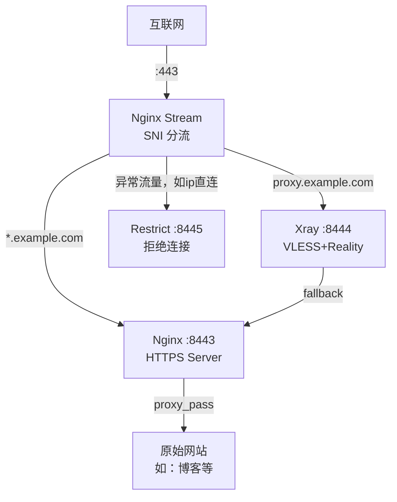

> **系列导航**
>
> 1. [VPS 初始化与基础环境配置](/posts/vps-xray-00-initialization)（本文）
> 2. [使用 Xray 搭建 VLESS+Vision+Reality 节点](/posts/vps-xray-01-vless-vision-reality)
> 3. [配置 SmartDNS 优化 DNS 解析](/posts/vps-xray-02-smartdns)
> 4. [购买域名并配置 Cloudflare DNS](/posts/vps-xray-03-domain-cloudflare)
> 5. [使用 acme.sh 申请免费 SSL 证书](/posts/vps-xray-04-acme-certificate)
> 6. [搭建 Nginx 反向代理服务](/posts/vps-xray-05-nginx-reverse-proxy)
> 7. [Nginx Stream SNI 分流实现 443 端口复用](/posts/vps-xray-06-nginx-stream-sni)

## 前言

本系列教程将带你从零开始，一步步搭建一个使用 Nginx Stream SNI 分流的 VLESS+Vision+Reality 节点。最终实现的架构如下：

- **443 端口复用**：通过 Nginx Stream 模块的 SNI 分流，让 Xray 流量和普通 HTTPS 流量共存
- **最佳伪装效果**：Xray 使用自己的域名和证书（"偷自己证书"），fallback 到真实网站
- **反向代理服务**：同时为其他服务提供安全的 HTTPS 访问



> 如果你更倾向于使用 sing-box，可以参考 [VPS 从零到一：多功能服务器搭建指南](/posts/vps-guide)。
>
> 由于 sing-box 移除了对 Proxy Protocol 的支持，导致SNI分流的方案无法传递访问者的真实 IP 信息，因此本系列教程使用支持 Proxy Protocol 的 Xray + Nginx Stream 方案，提供更灵活的 443 端口复用能力，并保留访问者 IP 信息便于反向代理时传递和日志记录。

## 准备工作

在开始之前，请确保你拥有：

- 一台全新的 VPS（本教程基于 **Debian 12** 系统）
- VPS 的 root 账号和密码（或已有 SSH 访问权限）
- 一台本地电脑（Windows/macOS/Linux 均可）

---

### 第一步：生成 SSH 密钥对

使用 SSH 密钥认证比密码登录更安全。首先在**本地电脑**上生成密钥对。

#### macOS / Linux

打开终端，执行：

```shell
# 生成 Ed25519 密钥对（推荐，更安全更快）
ssh-keygen -t ed25519 -C "your_email@example.com"
```

按提示操作：

- 密钥保存位置：直接回车使用默认路径 `~/.ssh/id_ed25519`
- 密码短语（passphrase）：可以设置一个密码保护私钥，也可以直接回车跳过

#### Windows

如果使用 Windows 10/11，可以使用 PowerShell：

```powershell
# 生成 Ed25519 密钥对
ssh-keygen -t ed25519 -C "your_email@example.com"
```

或者使用 [PuTTYgen](https://www.puttygen.com/) 图形化工具生成。

---

### 第二步：上传公钥到 VPS

将生成的公钥上传到 VPS，这样就可以使用密钥登录了。

#### 方法一：使用 ssh-copy-id（推荐）

```shell
# 将公钥复制到 VPS
# 请将 your_vps_ip 替换为你的 VPS IP 地址
ssh-copy-id -i ~/.ssh/id_ed25519.pub root@your_vps_ip
```

首次连接会提示确认指纹，输入 `yes`，然后输入 VPS 的 root 密码。

#### 方法二：手动复制

如果 `ssh-copy-id` 不可用，可以手动操作：

```shell
# 1. 查看公钥内容
cat ~/.ssh/id_ed25519.pub

# 2. SSH 登录到 VPS
ssh root@your_vps_ip

# 3. 在 VPS 上创建 .ssh 目录并添加公钥
mkdir -p ~/.ssh
chmod 700 ~/.ssh
echo "粘贴你的公钥内容" >> ~/.ssh/authorized_keys
chmod 600 ~/.ssh/authorized_keys
```

---

### 第三步：测试密钥登录

```shell
# 使用密钥登录 VPS（不需要输入密码）
ssh root@your_vps_ip
```

如果能够直接登录而不需要输入密码，说明密钥配置成功。

---

### 第四步：禁用密码登录（强烈推荐）

为了安全起见，确认密钥登录正常后，应该禁用密码登录。

> **坑点**：在禁用密码登录之前，请务必确认密钥登录已经成功！否则你可能会被锁在 VPS 外面。

```shell
# 编辑 SSH 配置文件
vim /etc/ssh/sshd_config
```

找到并修改以下配置项（如果前面有 `#` 注释符，需要删除）：

```
# 禁用密码认证
PasswordAuthentication no

# 禁用空密码
PermitEmptyPasswords no

# 允许公钥认证
PubkeyAuthentication yes

# 禁止 root 使用密码登录，但允许使用密钥
PermitRootLogin prohibit-password
```

保存文件后，重启 SSH 服务：

```shell
# 重启 SSH 服务使配置生效
systemctl restart sshd
```

> **重要**：重启 SSH 后，**不要关闭当前终端**！新开一个终端窗口测试是否能正常登录，确认无误后再关闭旧终端。

---

### 第五步：系统初始化

现在开始配置 VPS 系统环境。

#### 更新系统

```shell
# 更新软件包列表
apt update

# 升级已安装的软件包
apt upgrade -y
```

#### 设置时区

```shell
# 设置为上海时区
timedatectl set-timezone Asia/Shanghai

# 验证时区设置
timedatectl
```

#### 设置主机名（可选）

```shell
# 设置一个有意义的主机名
hostnamectl set-hostname my-vps

# 验证主机名
hostnamectl
```

---

### 第六步：安装必要依赖

安装后续教程所需的基础软件包：

```shell
# 安装常用工具
apt install -y curl wget vim git sudo htop unzip
```

> **提示**：Nginx 和 acme.sh 的依赖（如 socat）将在后续需要时安装。如果你只需要搭建基础的"偷别人证书"节点，这些依赖不是必须的。

---

### 第七步：防火墙配置（可选）

如果你的 VPS 启用了防火墙（如 ufw），需要开放必要端口：

```shell
# 安装 ufw（如果没有安装）
apt install -y ufw

# 允许 SSH 连接（重要！先执行这个）
ufw allow ssh

# 允许 HTTPS（Xray 监听端口）
ufw allow 443/tcp

# 启用防火墙
ufw enable

# 查看防火墙状态
ufw status
```

> **坑点**：启用防火墙前一定要先 `ufw allow ssh`，否则你会失去 SSH 访问权限！

---

## 总结

在本章中，我们完成了：

- ✅ 生成并配置 SSH 密钥认证
- ✅ 禁用密码登录提高安全性
- ✅ 更新系统并设置时区
- ✅ 安装基础依赖工具
- ✅ 配置防火墙开放必要端口

现在你的 VPS 已经具备了基础环境，可以开始部署 Xray 服务了。

---

**下一篇**：[VPS 节点搭建系列教程（二）：使用 Xray 搭建 VLESS+Vision+Reality 节点](/posts/vps-xray-01-vless-vision-reality)
