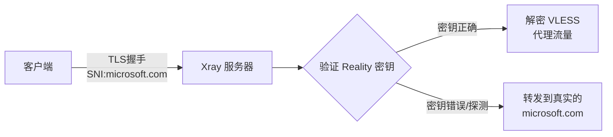

> **系列导航**
>
> 1. [VPS 初始化与基础环境配置](/posts/vps-xray-00-initialization)
> 2. [使用 Xray 搭建 VLESS+Vision+Reality 节点](/posts/vps-xray-01-vless-vision-reality)（本文）
> 3. [配置 SmartDNS 优化 DNS 解析](/posts/vps-xray-02-smartdns)
> 4. [购买域名并配置 Cloudflare DNS](/posts/vps-xray-03-domain-cloudflare)
> 5. [使用 acme.sh 申请免费 SSL 证书](/posts/vps-xray-04-acme-certificate)
> 6. [搭建 Nginx 反向代理服务](/posts/vps-xray-05-nginx-reverse-proxy)
> 7. [Nginx Stream SNI 分流实现 443 端口复用](/posts/vps-xray-06-nginx-stream-sni)

## 前言

在本章中，我们将使用 Xray 搭建一个 VLESS+Vision+Reality 节点。Reality 是 XTLS 团队开发的革命性协议，它的核心思想是 **"偷取"其他网站的 TLS 证书** 来伪装自己的流量。

### Reality 的工作原理

传统的 TLS 伪装需要你拥有一个域名和 SSL 证书。而 Reality 协议可以：

1. **无需域名和证书**：直接使用 Microsoft、Apple、Cloudflare 等网站的证书
2. **完美伪装**：外部探测者看到的是完全合法的 TLS 握手
3. **主动防御**：非法探测会被转发到真实的目标网站



### "偷别人证书" vs "偷自己证书"

本章我们先实现 **"偷别人证书"** 方案，即使用 `www.microsoft.com` 等网站作为伪装目标。这个方案的优点是无需域名，可以快速部署测试。

在系列最后一章，我们会升级为 **"偷自己证书"** 方案，使用自己的域名和证书，配合 Nginx SNI 分流实现最佳伪装效果。

---

### 第一步：安装 Xray

使用 Xray 官方提供的一键安装脚本：

```shell
# 下载并执行官方安装脚本
bash -c "$(curl -L https://github.com/XTLS/Xray-install/raw/main/install-release.sh)" @ install
```

安装完成后，验证安装：

```shell
# 查看 Xray 版本
xray version
```

你应该能看到类似以下输出：

```
Xray 25.12.8 (Xray, Penetrates Everything.) 81f8f39 (go1.25.5 linux/amd64)
A unified platform for anti-censorship.
```

---

### 第二步：生成必要的密钥

Xray Reality 需要几个关键的密钥和 ID，我们需要先生成它们。

#### 生成 UUID（用户标识）

```shell
# 生成 UUID
xray uuid
```

输出示例：`f47ac10b-58cc-4372-a567-0e02b2c3d479`

#### 生成 Reality 密钥对

```shell
# 生成 X25519 公私钥对
xray x25519
```

输出示例：

```
PrivateKey: oGSPyKx0tzTE1xdwbyer7r_1MLcn-1gZDkI89fZXYXg
Password: FH-eaEFSpFcjG-K3CNFXloHCkzttQRD1k_o0p-FwI2Y
Hash32: 9h-4fKDrYbnVDqbdLl2D0bcr20rQMDKCUSQM2WU1Iks
```

> **重要**：请保存好这两个密钥！
>
> - **Private key**（私钥）：配置在服务器端
> - **Password**（原 Public Key -> 公钥）：配置在客户端

#### 生成 Short ID

```shell
# 生成 16 位十六进制 short_id
openssl rand -hex 8
```

输出示例：`a1b2c3d4e5f67890`

---

### 第三步：选择目标网站

Reality 需要一个**目标网站**（dest/target）来进行伪装。这个网站需要满足以下条件：

- ✅ 支持 TLS 1.3
- ✅ 支持 X25519 密钥交换
- ✅ 支持 HTTP/2（h2）
- ⭐️ 加分项：网站服务器物理距离和你的VPS近 (IP 相近)
- ⭐️ 加分项：网站支持 OCSP Stapling

选取方法参考：https://github.com/XTLS/Xray-core/issues/2005#issuecomment-1538294415

**如果你懒得折腾，直接用下面的目标网站**：

| 域名                 | 说明               |
| -------------------- | ------------------ |
| `www.microsoft.com`  | 微软官网，稳定可靠 |
| `www.apple.com`      | 苹果官网           |
| `www.cloudflare.com` | Cloudflare 官网    |
| `www.amazon.com`     | 亚马逊官网         |
| `gateway.icloud.com` | iCloud 网关        |

#### 验证目标网站兼容性

你可以使用以下命令验证目标网站是否支持 TLS 1.3 和 X25519：

```shell
# 检查 TLS 版本和密钥交换算法
echo | openssl s_client -connect www.microsoft.com:443 -tls1_3 2>/dev/null | grep -E "(Protocol|Server Temp Key)"
```

如果输出包含 `TLSv1.3` 和 `X25519`，说明该网站兼容 Reality。

---

### 第四步：配置 Xray

现在我们来编写 Xray 的配置文件。

```shell
# 编辑 Xray 配置文件
vim /usr/local/etc/xray/config.json
```

将以下配置粘贴进去，并替换标记的占位符：

```json
{
  "log": {
    "loglevel": "info"
  },
  "inbounds": [
    {
      "tag": "VLESS-Vision-REALITY",
      "listen": "::",
      "port": 443,
      "protocol": "vless",
      "settings": {
        "clients": [
          {
            "id": "替换为你的UUID",
            "flow": "xtls-rprx-vision"
          }
        ],
        "decryption": "none"
      },
      "streamSettings": {
        "network": "raw",
        "security": "reality",
        "realitySettings": {
          "show": false,
          "dest": "www.microsoft.com:443",
          "serverNames": ["www.microsoft.com"],
          "privateKey": "替换为你的私钥",
          "shortIds": ["替换为你的shortId"]
        }
      }
    }
  ],
  "outbounds": [
    {
      "tag": "direct",
      "protocol": "freedom"
    },
    {
      "tag": "block",
      "protocol": "blackhole"
    }
  ]
}
```

#### 配置项详解

| 配置项                   | 说明                                        |
| ------------------------ | ------------------------------------------- |
| `port: 443`              | 监听 443 端口（标准 HTTPS 端口）            |
| `protocol: vless`        | 使用 VLESS 协议                             |
| `id`                     | 你生成的 UUID，用于客户端认证               |
| `flow: xtls-rprx-vision` | 启用 Vision 流控，提供更好的性能和伪装      |
| `network: raw`           | 使用 TCP 传输                               |
| `security: reality`      | 使用 Reality 安全层                         |
| `dest`                   | 目标网站地址，用于 TLS 伪装                 |
| `serverNames`            | 允许的 SNI 列表，客户端需要使用这些域名连接 |
| `privateKey`             | 你生成的 X25519 私钥                        |
| `shortIds`               | 短 ID 列表，用于额外的认证                  |

---

### 第五步：启动 Xray 服务

```shell
# 检查配置文件语法是否正确
xray run -test -config /usr/local/etc/xray/config.json
```

如果配置正确，你会看到类似输出：

```
Xray 25.12.8 (Xray, Penetrates Everything.) 81f8f39 (go1.25.5 linux/amd64)
A unified platform for anti-censorship.
2026/01/05 01:04:18.383694 [Info] infra/conf/serial: Reading config: &{Name:/usr/local/etc/xray/config.json Format:json}
```

现在启动服务：

```shell
# 重启 Xray 服务
systemctl restart xray

# 设置开机自启
systemctl enable xray

# 查看服务状态
systemctl status xray
```

如果状态显示 `active (running)`，说明 Xray 已成功启动。

#### 查看运行日志

```shell
# 实时查看 Xray 日志
journalctl -u xray -o cat -f
```

按 `Ctrl+C` 退出日志查看。

---

### 第六步：配置客户端

现在服务器已经准备就绪，我们需要配置客户端来连接。

#### 连接信息汇总

根据你的配置，整理以下信息：

| 参数               | 值                |
| ------------------ | ----------------- |
| 地址 (Address)     | 你的 VPS IP 地址  |
| 端口 (Port)        | 443               |
| 协议 (Protocol)    | vless             |
| UUID               | 你生成的 UUID     |
| 流控 (Flow)        | xtls-rprx-vision  |
| 传输层 (Network)   | tcp               |
| 安全 (Security)    | reality           |
| SNI                | www.microsoft.com |
| 指纹 (Fingerprint) | chrome            |
| 公钥 (Public Key)  | 你生成的公钥      |
| Short ID           | 你生成的 shortId  |

#### v2rayN 配置（Windows）

1. 打开 v2rayN
2. 服务器 → 添加 [VLESS] 服务器
3. 填入上述信息
4. 传输层安全选择 `reality`
5. 填入公钥和 shortId

#### Clash Meta / Mihomo 配置

```yaml
proxies:
  - name: 'My-Reality'
    type: vless
    server: 你的VPS_IP
    port: 443
    udp: true
    uuid: 你的UUID
    flow: xtls-rprx-vision
    packet-encoding: xudp
    tls: true
    servername: www.microsoft.com
    alpn:
      - h2
      - http/1.1
    client-fingerprint: chrome
    skip-cert-verify: false
    reality-opts:
      public-key: 你的公钥
      short-id: 你的shortId
    network: tcp
    smux:
      enabled: false
```

#### 分享链接格式

```
vless://UUID@VPS_IP:443?encryption=none&flow=xtls-rprx-vision&security=reality&sni=www.microsoft.com&fp=chrome&pbk=公钥&sid=shortId&type=tcp#节点名称
```

---

### 第七步：连接测试

配置好客户端后，尝试连接并访问网站测试是否正常工作。

1. 在客户端开启代理
2. 访问 [https://www.google.com](https://www.google.com) 测试连通性
3. 访问 [https://ip.sb](https://ip.sb) 确认出口 IP 是否为 VPS IP

#### 常见问题排查

**问题 1：连接超时**

```shell
# 检查 443 端口是否开放
ss -tlnp | grep 443

# 检查防火墙
ufw status
```

**问题 2：Reality 握手失败**

- 确认客户端的公钥与服务器的私钥是配对的
- 确认 shortId 完全一致
- 确认 serverName/SNI 在服务器配置的 serverNames 列表中

**问题 3：连接后无法访问网站**

```shell
# 查看 Xray 日志
journalctl -u xray -o cat -f

# 检查 DNS 解析
nslookup google.com
```

---

## 总结

在本章中，我们完成了：

- ✅ 安装 Xray 核心
- ✅ 生成 UUID、Reality 密钥对和 Short ID
- ✅ 配置 VLESS+Vision+Reality（"偷别人证书"方案）
- ✅ 配置客户端并成功连接

现在你已经拥有了一个基础的 Reality 节点。在后续章节中，我们会：

1. 配置 SmartDNS 优化 DNS 解析
2. 申请自己的域名和证书
3. 使用 Nginx SNI 分流实现 **"偷自己证书"** 的最佳伪装方案

---

**上一篇**：[VPS 节点搭建系列教程（一）：VPS 初始化与基础环境配置](/posts/vps-xray-00-initialization)

**下一篇**：[VPS 节点搭建系列教程（三）：配置 SmartDNS 优化 DNS 解析](/posts/vps-xray-02-smartdns)
