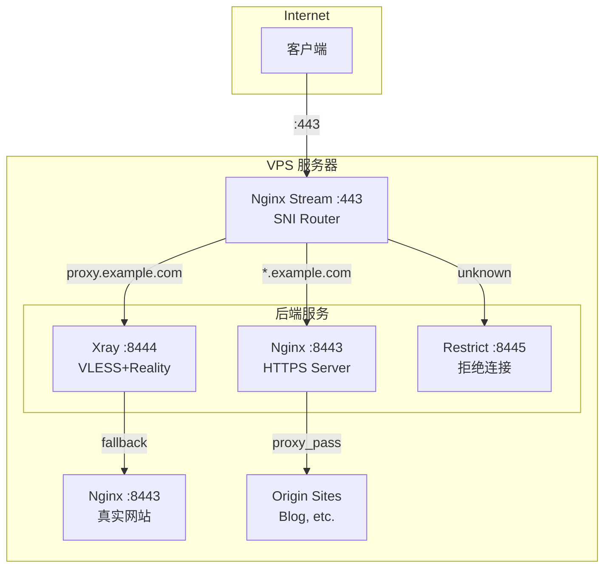
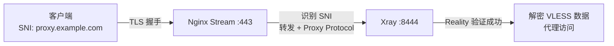
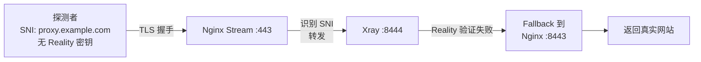
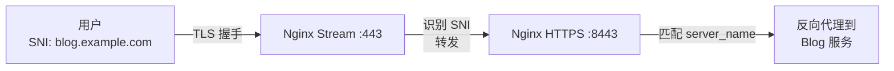

> **系列导航**
>
> 1. [VPS 初始化与基础环境配置](/posts/vps-xray-00-initialization)
> 2. [使用 Xray 搭建 VLESS+Vision+Reality 节点](/posts/vps-xray-01-vless-vision-reality)
> 3. [配置 SmartDNS 优化 DNS 解析](/posts/vps-xray-02-smartdns)
> 4. [购买域名并配置 Cloudflare DNS](/posts/vps-xray-03-domain-cloudflare)
> 5. [使用 acme.sh 申请免费 SSL 证书](/posts/vps-xray-04-acme-certificate)
> 6. [搭建 Nginx 反向代理服务](/posts/vps-xray-05-nginx-reverse-proxy)
> 7. [Nginx Stream SNI 分流实现 443 端口复用](/posts/vps-xray-06-nginx-stream-sni)（本文）

## 前言

这是本系列的最后一章，也是最精华的部分。我们将使用 Nginx Stream 模块实现 443 端口的 SNI 分流，让 Xray 流量和普通 HTTPS 流量共存于同一个端口。

### 最终架构



### 什么是 SNI 分流？

SNI（Server Name Indication）是 TLS 握手时客户端发送的目标域名信息。Nginx Stream 模块可以在不解密 TLS 的情况下读取 SNI，根据域名将流量转发到不同的后端。

这意味着：

- **同一个 443 端口**可以服务多个不同的应用
- Xray 和 Nginx 可以**共享 443 端口**
- 对于探测者来说，看到的是**完全正常的 HTTPS 网站**

### "偷自己证书" vs "偷别人证书"

| 方案       | 优点                          | 缺点                         |
| ---------- | ----------------------------- | ---------------------------- |
| 偷别人证书 | 无需域名、证书                | 无法搭建真实网站，伪装度较低 |
| 偷自己证书 | 最佳伪装，fallback 到真实网站 | 需要域名和证书               |

本章实现的"偷自己证书"方案是 Reality 的最佳实践。

---

### 第一步：理解 Proxy Protocol

在开始配置之前，我们需要理解 Proxy Protocol。

#### 什么是 Proxy Protocol？

当 Nginx Stream 转发流量时，后端服务看到的源 IP 是 127.0.0.1（因为是 Nginx 本地转发）。Proxy Protocol 可以在 TCP 连接开始时发送原始客户端 IP 信息。

```
客户端 (1.2.3.4) ──> Nginx Stream ──>
后端服务添加 Proxy Protocol 头: "PROXY TCP4 1.2.3.4 ..."
```

> **重要**：Proxy Protocol 需要**发送方和接收方同时支持**才能工作：
>
> - **发送方**（如 Nginx Stream）需要配置 `proxy_protocol on` 来发送协议头
> - **接收方**（如 Xray、Nginx HTTP）需要配置为接收 Proxy Protocol 才能正确解析
>
> 如果只有一方支持，连接将会失败。这就是为什么在本教程中，我们需要同时配置 Nginx Stream 的 `proxy_protocol on` 和 Xray/Nginx HTTP 的 `xver`、`acceptProxyProtocol`/`proxy_protocol` 选项。

---

### 第二步：修改 Xray 配置

现在开始修改 Xray 配置，让它：

1. 监听 127.0.0.1:8444（而非 0.0.0.0:443）
2. 接受 Proxy Protocol
3. 使用自己的域名作为 serverName
4. Fallback 到 Nginx 的真实网站

```shell
vim /usr/local/etc/xray/config.json
```

完整配置：

```json
{
  "log": {
    "loglevel": "info"
  },
  "dns": {
    "servers": ["udp://127.0.0.1:5353"]
  },
  "inbounds": [
    {
      "tag": "VLESS-Vision-REALITY",
      "listen": "127.0.0.1",
      "port": 8444,
      "protocol": "vless",
      "settings": {
        "clients": [
          {
            "id": "替换为你的UUID",
            "flow": "xtls-rprx-vision"
          }
        ],
        "decryption": "none"
      },
      "streamSettings": {
        "network": "raw",
        "security": "reality",
        "realitySettings": {
          "show": false,
          "target": "127.0.0.1:8443",
          "xver": 1,
          "serverNames": ["proxy.example.com"],
          "privateKey": "替换为你的私钥",
          "shortIds": ["替换为你的shortId"]
        },
        "rawSettings": {
          "acceptProxyProtocol": true
        }
      }
    }
  ],
  "outbounds": [
    {
      "tag": "direct",
      "protocol": "freedom"
    },
    {
      "tag": "block",
      "protocol": "blackhole"
    }
  ]
}
```

#### 关键配置说明

| 配置项                | 值                      | 说明                                   |
| --------------------- | ----------------------- | -------------------------------------- |
| `listen`              | `127.0.0.1`             | 只监听本地，由 stream 转发             |
| `port`                | `8444`                  | Xray 监听端口                          |
| `target`              | `127.0.0.1:8443`        | Fallback 到 Nginx HTTPS                |
| `xver`                | `1`                     | 向 fallback 目标发送 Proxy Protocol v1 |
| `serverNames`         | `["proxy.example.com"]` | 使用自己的域名                         |
| `acceptProxyProtocol` | `true`                  | 接受来自 stream 的 Proxy Protocol      |

> **重要变化**：
>
> - `xver` 和 `acceptProxyProtocol`，支持 Proxy Protocol
> - `target` 指向本地 Nginx，而非外部网站
> - `serverNames` 使用自己的域名，而非 microsoft.com

---

### 第三步：配置 Nginx Stream 模块

创建 Stream 模块配置文件：

```shell
vim /etc/nginx/modules-enabled/stream.conf
```

```nginx
stream {
    # 日志格式
    log_format stream_log '$remote_addr [$time_local] '
                         '$protocol $status $bytes_sent $bytes_received '
                         '$session_time "$ssl_preread_server_name"';

    access_log /var/log/nginx/stream.log stream_log;

    # SNI 路由映射
    # 根据 TLS 握手中的 SNI 字段决定转发目标
    map $ssl_preread_server_name $tcpsni_name {
        hostnames;
        # Xray 使用的域名 -> 转发到 Xray
        proxy.example.com      xray;
        # 其他子域名 -> 转发到 Nginx HTTPS
        *.example.com         nginx_https;
        # 未知域名 -> 拒绝
        default               restrict;
    }

    # 上游：Xray
    upstream xray {
        server 127.0.0.1:8444;
    }

    # 上游：Nginx HTTPS
    upstream nginx_https {
        server 127.0.0.1:8443;
    }

    # 上游：拒绝服务
    upstream restrict {
        server 127.0.0.1:8445;
    }

    # 主监听器 - 443 端口
    server {
        listen 443 reuseport;
        listen [::]:443 reuseport;

        # 启用 SNI 预读
        ssl_preread on;

        # 向后端发送 Proxy Protocol
        proxy_protocol on;

        # 根据 SNI 转发
        proxy_pass $tcpsni_name;
    }
}
```

#### 配置说明

| 配置项                         | 说明                         |
| ------------------------------ | ---------------------------- |
| `ssl_preread on`               | 启用 SNI 预读，不解密 TLS    |
| `proxy_protocol on`            | 向后端发送 Proxy Protocol 头 |
| `map $ssl_preread_server_name` | 根据 SNI 映射到不同上游      |
| `reuseport`                    | 提高多核 CPU 性能            |

#### SNI 路由规则

在这个配置中：

1. **proxy.example.com** → Xray（8444 端口）

   - 客户端使用这个域名连接 Xray
   - Xray 处理 VLESS+Reality 流量

2. **\*.example.com**（其他子域名）→ Nginx HTTPS（8443 端口）

   - blog.example.com、dashboard.example.com 等
   - Nginx 提供正常的反向代理服务

3. **其他域名或无 SNI** → Restrict（8445 端口）
   - 拒绝连接，提高安全性

---

### 第四步：更新 Nginx HTTP 配置

确保 Nginx HTTP 服务器配置了正确的 Proxy Protocol 支持（上一章已配置）。

检查 `/etc/nginx/sites-available/blog.conf`：

```nginx
server {
    # 注意：proxy_protocol 参数
    listen 127.0.0.1:8443 ssl http2 proxy_protocol;

    # 从 Proxy Protocol 获取真实 IP
    set_real_ip_from           127.0.0.1;
    real_ip_header             proxy_protocol;

    # ... 其他配置
}
```

---

### 第五步：确保 Restrict 服务正常

检查 `/etc/nginx/conf.d/restrict.conf`：

```nginx
# 拒绝未知 HTTPS 连接
server {
    listen               127.0.0.1:8445 ssl proxy_protocol default_server;
    set_real_ip_from     127.0.0.1;
    real_ip_header       proxy_protocol;
    ssl_reject_handshake on;
    return               444;
}
```

> **注意**：这个服务需要 SSL 证书才能启动（即使我们会拒绝握手）。可以使用同一个证书，或者暂时注释掉 `ssl_reject_handshake` 来避免问题。

如果没有证书会报错，可以临时修改为：

```nginx
server {
    listen               127.0.0.1:8445 proxy_protocol default_server;
    set_real_ip_from     127.0.0.1;
    real_ip_header       proxy_protocol;
    return               444;
}
```

---

### 第六步：应用配置

```shell
# 测试 Nginx 配置
nginx -t

# 如果测试通过，重启服务
systemctl restart nginx

# 重启 Xray
systemctl restart xray

# 检查服务状态
systemctl status nginx
systemctl status xray
```

---

### 第七步：验证配置

#### 检查端口监听

```shell
ss -tlnp | grep -E "(443|8443|8444|8445)"
```

预期输出：

```
LISTEN  0  511  0.0.0.0:443      ...  nginx
LISTEN  0  511  [::]:443         ...  nginx
LISTEN  0  511  127.0.0.1:8443   ...  nginx
LISTEN  0  511  127.0.0.1:8444   ...  xray
LISTEN  0  511  127.0.0.1:8445   ...  nginx
```

#### 检查 Stream 日志

```shell
tail -f /var/log/nginx/stream.log
```

当有连接时，你会看到 SNI 分流的日志：

```
1.2.3.4 [05/Jan/2026:10:00:00 +0000] TCP 200 1234 5678 10.5 "proxy.example.com"
```

#### 测试 Xray 连接

更新客户端配置，使用新的域名和端口：

| 参数     | 值                           |
| -------- | ---------------------------- |
| 地址     | 你的 VPS IP 或域名           |
| 端口     | 443                          |
| SNI      | proxy.example.com            |
| 公钥     | 你的公钥（与服务器私钥配对） |
| Short ID | 你的 shortId                 |

连接测试：

1. 在客户端开启代理
2. 访问 [https://ip.sb](https://ip.sb) 确认出口 IP
3. 访问其他网站测试连通性

#### 测试反向代理

在浏览器中访问：

- `https://proxy.example.com` - 如果是普通浏览器访问，会 fallback 到 Nginx 的反向代理
- `https://blog.example.com` - 直接到 Nginx HTTPS 服务

---

## 架构总结

### 流量路径

**Xray 客户端流量**：



**Xray 探测/普通浏览器流量**：



**其他子域名流量**：



### "偷自己证书" 的优势

1. **完美伪装**：探测者看到的是真实运行的网站
2. **无异常特征**：使用自己的域名和证书，TLS 指纹完全正常
3. **功能丰富**：同时拥有代理和真实网站服务
4. **端口复用**：只需要开放 443 端口

---

## 常见问题

**问题 1：Xray 无法启动**

```shell
# 查看 Xray 日志
journalctl -u xray -n 50

# 测试配置语法
xray run -test -config /usr/local/etc/xray/config.json
```

常见原因：

- JSON 语法错误
- `network` 应该是 `raw` 而非 `tcp`
- 证书路径错误

**问题 2：客户端连接超时**

- 确认 443 端口已开放：`ufw status`
- 确认 stream 模块正常加载：`nginx -t`
- 检查 SNI 是否正确匹配

**问题 3：Fallback 不工作**

- 确认 `target` 指向正确的 Nginx 端口
- 确认 Nginx 8443 端口正在监听
- 检查 Nginx 是否配置了对应的 server_name

**问题 4：无法获取真实 IP**

- 确认 Xray 配置了 `acceptProxyProtocol: true`
- 确认 Nginx 配置了 `proxy_protocol` 和 `set_real_ip_from`
- 检查日志格式是否包含 `$proxy_protocol_addr`

---

## 系列总结

恭喜你完成了整个系列教程！现在你拥有了一个功能完整的 VPS：

### 已实现的功能

- ✅ **SSH 密钥认证**：安全的服务器访问
- ✅ **Xray VLESS+Vision+Reality**：高性能代理服务
- ✅ **SmartDNS**：智能 DNS 解析优化
- ✅ **泛域名 SSL 证书**：自动续签的 HTTPS 证书
- ✅ **Nginx 反向代理**：为家庭服务提供安全访问
- ✅ **443 端口复用**：代理和网站共存
- ✅ **最佳伪装**："偷自己证书"方案

### 与 sing-box 方案的对比

| 特性         | 本系列（Xray + Nginx Stream） | vps-guide（sing-box） |
| ------------ | ----------------------------- | --------------------- |
| 代理核心     | Xray                          | sing-box              |
| 443 端口复用 | ✅ Stream SNI 分流            | ❌ 独立端口           |
| Reality 伪装 | ✅ 偷自己证书                 | ✅ 偷别人证书         |
| 配置复杂度   | 较高                          | 较低                  |
| 灵活性       | 高                            | 中                    |

### 进阶方向

如果你想进一步优化，可以考虑：

1. **Cloudflare WARP 出站**：解锁特定网站（如 ChatGPT）
2. **分流规则**：根据域名或 IP 选择不同出站
3. **多用户管理**：配置多个 UUID
4. **流量统计**：使用 Xray API 或第三方面板

感谢你跟随本系列教程，祝你使用愉快！

---

**上一篇**：[VPS 节点搭建系列教程（六）：搭建 Nginx 反向代理服务](/posts/vps-xray-05-nginx-reverse-proxy)

**系列首篇**：[VPS 节点搭建系列教程（一）：VPS 初始化与基础环境配置](/posts/vps-xray-00-initialization)
